<h2>
  Hey there! I'm Xitong Ling.
</h2>

<h3>👨🏻‍💻 About Me</h3>

- 🔭 &nbsp; Bachelor: Beihang University
- 🤔 &nbsp; Master: Tsinghua University
- 🎓 &nbsp; Fields: AI4Healthcare / 3DV / World Model
- 💼 &nbsp; Email: lingxt23@mails.tsinghua.edu.cn/
- 🧬 &nbsp; Research Interests: Computational Pathology, Foundation Models, Medical AI, WSI Analysis

 

<h3>🛠 Tech Stack</h3>

- 💻 &nbsp; Python | Java | C++ | C#
- 🛢 &nbsp; MySQL | Firebase | XAMPP | Docker
- 🔧 &nbsp; VS Code | PyCharm | Eclipse | Git
- 🧠 &nbsp; PyTorch | Hugging Face | OpenCV | Scikit-learn

 

<h3>📊 GitHub Stats</h3>

  

  

 

  Feel free to reach me at:
   
  <b>Email:</b> lingxt23@mails.tsinghua.edu.cn

 

<!-- Optional: Contribution Snake -->
<!--

  

-->
