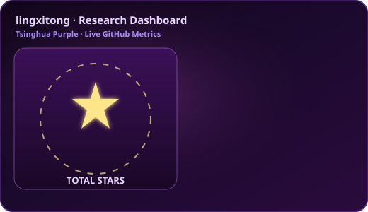
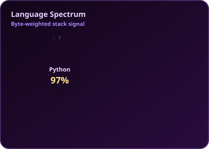
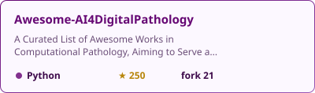
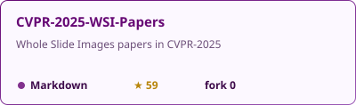

  

  
  
  

    

  

---

### About Me

  

  
  
  
  

- Bachelor: Beihang University
- PhD Student: Tsinghua University (SIGS)
- Research Fields: Representation Learning / AI4Healthcare
- Interests: Computational Pathology, Foundation Models, Multimodal Learning, WSI Analysis
- Email: lingxt23@mails.tsinghua.edu.cn

---

### GitHub Stats

<table width="100%">
  <tr>
    <td width="55%" valign="top">
      
    </td>
    <td width="45%" valign="top">
      
    </td>
  </tr>
</table>

---

### Featured Work

<table width="100%">
  <tr>
    <td width="50%" valign="top">
      
    </td>
    <td width="50%" valign="top">
      
    </td>
  </tr>
  <tr>
    <td width="50%" valign="top">
      
    </td>
    <td width="50%" valign="top">
      
    </td>
  </tr>
</table>

---

### Tech Stack

  

  
  
  
  
  
  

---

### Contribution Snake

  <picture>
    <source media="(prefers-color-scheme: dark)" srcset="https://raw.githubusercontent.com/lingxitong/lingxitong/output/github-contribution-grid-snake-dark.svg">
    <source media="(prefers-color-scheme: light)" srcset="https://raw.githubusercontent.com/lingxitong/lingxitong/output/github-contribution-grid-snake.svg">
    
  </picture>

---

  <b>Feel free to reach out for research discussion & collaboration.</b>
   
  Homepage: <a href="https://lingxitong.github.io/">lingxitong.github.io</a>
  · Email: <a href="mailto:lingxt23@mails.tsinghua.edu.cn">lingxt23@mails.tsinghua.edu.cn</a>
    
  

