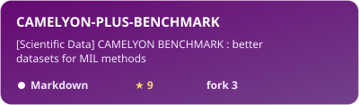

<table width="100%">
  <tr>
    <td align="center" width="25%">
      
    </td>
    <td align="center" width="25%">
      
    </td>
    <td align="center" width="25%">
      
    </td>
    <td align="center" width="25%">
      
    </td>
  </tr>
</table>

### About Me

I am a **PhD student at Tsinghua University (SIGS)**, previously trained at **Beihang University**. My research sits at the intersection of **representation learning** and **AI4Healthcare**, with a particular focus on computational pathology, whole-slide image analysis, and multimodal medical intelligence.

| | |
|---|---|
| **Education** | Beihang University (B.S.) → Tsinghua University (Ph.D.) |
| **Fields** | Representation Learning / AI4Healthcare |
| **Topics** | Computational Pathology · Foundation Models · MIL · Multimodal Learning · WSI Analysis |
| **Homepage** | [lingxitong.github.io](https://lingxitong.github.io/) |
| **Email** | [lingxt23@mails.tsinghua.edu.cn](mailto:lingxt23@mails.tsinghua.edu.cn) |

### GitHub Stats

<table width="100%">
  <tr>
    <td width="55%" valign="top">
      
    </td>
    <td width="45%" valign="top">
      
    </td>
  </tr>
</table>

### Highlights

<table width="100%">
  <tr>
    <td width="50%" valign="top">

**Selected Outcomes**
- Papers in venues such as **NPJ Digital Medicine**, **AAAI**, **CVPR**, **MIDL**, **JBHI**
- Open-source ecosystem around **MIL baselines** and pathology resources
- Curated paper lists for **WSI / computational pathology**

    </td>
    <td width="50%" valign="top">

**Service & Recognition**
- Reviewer: ACM-MM / MICCAI / AAAI
- National Scholarship (Tsinghua)
- Outstanding Graduates (Beijing)
- Continuously maintaining community resources for digital pathology

    </td>
  </tr>
</table>

### Featured Work

<table width="100%">
  <tr>
    <td width="50%" valign="top">
      
    </td>
    <td width="50%" valign="top">
      
    </td>
  </tr>
  <tr>
    <td width="50%" valign="top">
      
    </td>
    <td width="50%" valign="top">
      
    </td>
  </tr>
  <tr>
    <td width="50%" valign="top">
      
    </td>
    <td width="50%" valign="top">
      
    </td>
  </tr>
</table>

### Tech Stack

  

<table width="100%">
  <tr>
    <td align="center"></td>
    <td align="center"></td>
    <td align="center"></td>
  </tr>
  <tr>
    <td align="center"></td>
    <td align="center"></td>
    <td align="center"></td>
  </tr>
</table>

**Toolkit focus:** weakly-supervised WSI pipelines · pathology foundation models · reproducible MIL benchmarks · research engineering

### Contribution Snake

---

<table width="100%">
  <tr>
    <td align="center">
      <b>Open to research discussion, collaboration, and open-source contributions.</b> 
      <a href="https://lingxitong.github.io/">Homepage</a>
      ·
      <a href="mailto:lingxt23@mails.tsinghua.edu.cn">Email</a>
      ·
      <a href="https://github.com/lingxitong">GitHub</a>
    </td>
  </tr>
</table>

